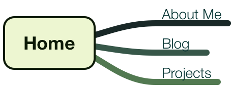

# Reflection on 2.3 *Introduction to Design and Site Planning*

####Why use relative links?
I think we used relative links since it's easier for links to be found when they are in the same (or nearby) directory, it makes changes easier. If you were to move your directories into a different repo, and you had used an absolute path, it wouldn't be able to find your file beucase the link would send it looking in the old location. 

#### What are the 6 Phases of Web Design?
* **Information Gathering** - Think about purpose, goal, audience and info.
* **Planning** - Make site map. (See baisc site map below.)
* **Design** - Develop initial wireframes, prototypes and think critically about choices made so far and if you are on track with your original needs.
* **Development** - Coding can begin!
* **Testing and Delivery** - Fine tune and publish site.
* **Maintenance** - Work is never done! Keep site up to date and respond to user needs.

#### What is your site's primary goal or purpose? What kind of content will your site feature?
To display my abilities and my personality, for professional use, to potential employers.

#### What is your target audience's interests and how do you see your site addressing them?
At this point I am just trying to attract people who are looking to hire jr web developers. My first few blogs will be less than impressive in that respect, but hopefully they’ll get more interesting.

#### What is the primary "action" the user should take when coming to your site? Do you want them to search for information, contact you, or see your portfolio? It's ok to have several actions at once, or different actions for different kinds of visitors.
See portfolio…but to get people interested in the portfolio, it would be good to have an interesting blog with searchable info…

#### What are the main things someone should know about design and user experience? What is user experience design and why is it valuable?
Paraphrased from [one of the suggested sources](http://www.smashingmagazine.com/2010/10/what-is-user-experience-design-overview-tools-and-resources/ “UXD Overview”).
“UX design is driven by user *feelings* when using a system. We can design for experiences and behaviors, but we can’t impose or predict the actual user experience. 

Usability is about user-friendliness and efficiency. Usability is a part of UX. 

In some ways, UXD is pretty theoretical, so it’s easy to see why some people might not want to give it to much thought, but those are the same people who likely think you can teach someone by hitting them over the head repeatedly.
UXD can help websites attract the audience they desire, rather than sending them scurrying away after an unpleasant experience.

#### Which parts of the challenge did you find tedious?
I liked this challenge, though thinking about potential employers seems slightly impractical, since I don’t have any skills yet. :smirk: But if my pull request workflow works this time, the whole thing will be a success!

####Success! :smiley: I decided to edit this to celebrate completle success with git workflow!
