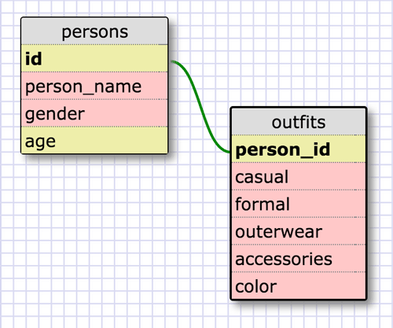

### SELECTing data FROM a database
##### 1. Select all data for all states.
	SELECT * FROM states;

##### 2. Select all data for all regions.
	SELECT * FROM regions;

##### 3. Select the state_name and population for all states.
	SELECT state_name, population 
	FROM states;

##### 4. Select the state_name and population for all states ordered by population. The state with the highest population should be at the top.
	SELECT state_name, population 
	FROM states ORDER BY population desc;

##### 5. Select the state_name for the states in region 7.
	SELECT state_name
	FROM States
	WHERE region_id=7;

##### 6. Select the state_name and population_density for states with a population density over 50 ordered FROM least to most dense.
	SELECT state_name, population_density FROM states
	WHERE population_density > 50
	ORDER BY population_density;

##### 7. Select the state_name for states with a population between 1 million and 1.5 million people.
	SELECT state_name FROM states
	WHERE population BETWEEN 1000000 and 1500000;

##### 8. Select the state_name and region_id for states ordered by region in ascending order.
	SELECT state_name, region_id
   	FROM states ORDER BY region_id;

##### 9. Select the region_name fo'/;l.,b r the regions with "Central" in the name.
	SELECT * FROM regions
	WHERE region_name LIKE "%Central%";

##### 10. Select the region_name and the state_name for all states and regions in ascending order by region_id. Refer to the region by name. (This will involve joining the tables).
	SELECT regions.region_name, states.state_name
	FROM states 
	INNER JOIN regions
	ON states.region_id=regions.id 
	ORDER BY states.region_id;

### Your Own Schema
##### Clueless!

### Reflection:
##### What are databases for?
	Organizing, sorting and generally managing data.

##### What is a one-to-many relationship?
	A one-to-many relationship reads like "There are many bananas in a bunch, a bunch has many bananas."

##### What is a primary key? What is a foreign key? How can you determine which is which?
	A primary key is a unique identifier that is necessary for each record in a database. 
	A primary key is always necessary, but can be changed to best suit user needs. 
	A foreign key comes from an additional, secondary table that connects back to the primary key of the first table. (Well, usually the primary key.) 
	A primary key can be the target of many foreign keys.

##### How can you select information out of a SQL database? What are some general guidelines for that?
	SELECT _____ FROM _______;
	The keywords don't have to be all caps, but it's customary. 
	If you want to select multiple columns, separate with commas. 
	Spaces and line breaks don't matter, but are used for readability. Every request should end with a semicolon.
	Commands read very logically as imperative statements!

