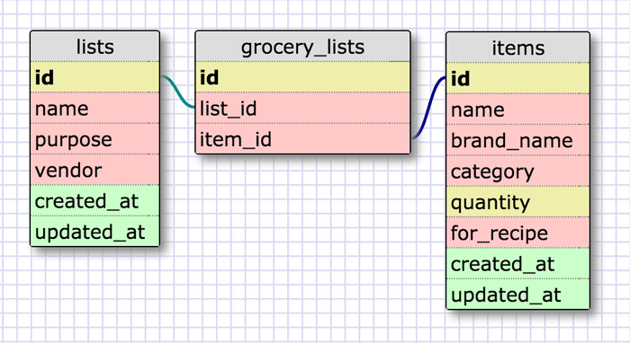
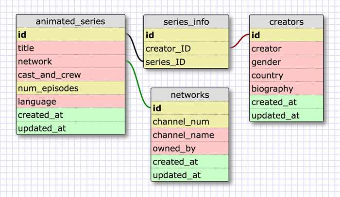

## 8.5 More Schemas

#### Create a One-to-one Schema
Consider books. Books always have a distinct title, but when books get published each version of a title (Hardcover, paperback, kindle) has a different ISBN.

#### Many to Many Relationships
Grocery Lists

Animated Series (just for practice)

#### Reflect
##### What is a one-to-one database?
A one-to-one database connects one table to another when info can be considered a "pair". It can be useful to break up info to avoid unnecessary repetition and to minimize space used. Repetitive table info also increases the chance of human error.

##### When would you use a one-to-one database? (Think generally, not in terms of the example you created).
Whenever you have a set of information that has exactly one possible answer, a one-to-one database could be useful.

##### What is a many-to-many database?
Many-to-many databases are easier to think about. All the ways that info branches off in other directions just make sense. There will probably be a join table containing unique IDs from other tables. 
A one-to-many relationship reads like "There are many bananas in a bunch, a bunch has many bananas."
Then many-to-many might be "There are many trees in a forest, a forest has many trees. Trees have many leaves, there are many leaves in a forest. There are also many animals in a forest."
##### When would you use a many-to-many database? (Think generally, not in terms of the example you created).
Many-to-many databases allow you to connect all sorts of different, but related info. Anytime table info looks redundant, it probably makes sense to split it up and then connect the tables.

##### What is confusing about database schemas? What makes sense?
One-to-one relationships seem really limiting...just a starting point, rather than a full concept. I can only think of a few examples, and even then, I can always think of another way to branch off...